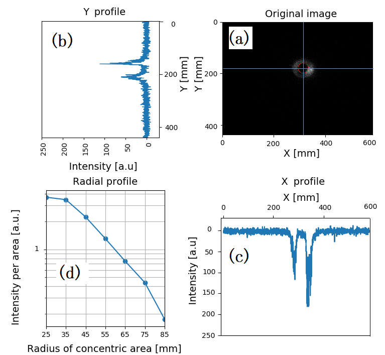
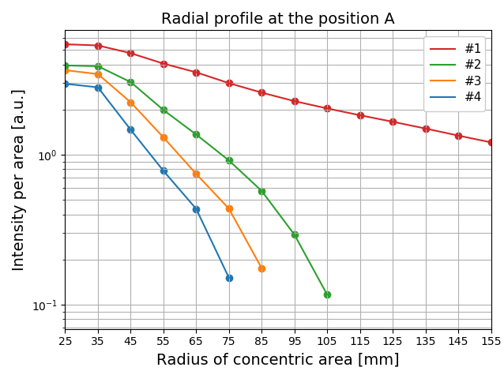

# The Programs of the Aperture Testing System to reduce the Stray Light of Thomson scattering.

# Directories

- data/   
The result of the raw image on each aperture configuration. (ignored on git)

- npydata/  
The npydata converted from the raw image with some analysis. (ignored on git)
    - /differed/  
    Images accumulated and differed from the background.
    - /dscan/
    The npydata of the axial direction profile.
    - /rscan/
    The npydata of the radial profiles.
    - /etc/  

- npydatam/  (ignore on git)  
The npydata modified for the geometrical distortion.

- scripts/  
The scripts for analysis are written by python 3 and separated into each function.
    - axiscut.py  
    this shows X-Y distribution of the raw or modified image.
    - integrate.py  
    this accumulates the raw images within a directory to improve S/N.
    - differ.py  
    this subtracts the background image from the raw one.
    - trapezoid.py  
    this modifies the geometrical distortion of the camera.
    - rscan.py  
    this analyzes radial profile of a image.  
    - rscan_plot.py  
    this shows radial profile plot.   
    - dscan.py  
    this analyzes axial direction profile.
    - dscan_plot.py
    this shows axial direction profile plot.

# Processing

1. Accumulation  
Accumulate the raw images with integrate.py.  
2. Subtraction  
Substract the background from the image with differ.py.  
3. Modification  
Modify the geometrical distortion with trapezoid.py.

## X-Y distribution Analysis

4. Plot
Show X-Y distribution with axiscut.py.  

## Radial Profile Analysis

4. Analysis
Analyze the image to make radial profile with rscan.py.
5. Plot
Show some radial profiles with rscan_plot.py.

## Axial Direction Analysis

4. Analysis
Analyze the image to make profile with dscan.py.
5. Plot
Show some profiles with dscan_plot.py.

## etc
Paper:
Improvement of Aperture Configuration to Reduce the Stray Light for Thomson Scattering Measurement Using a Peripheral Beam Profile Monitor, Yuya KAWAMATA et al., Volume 14, 1402072 (2019)
